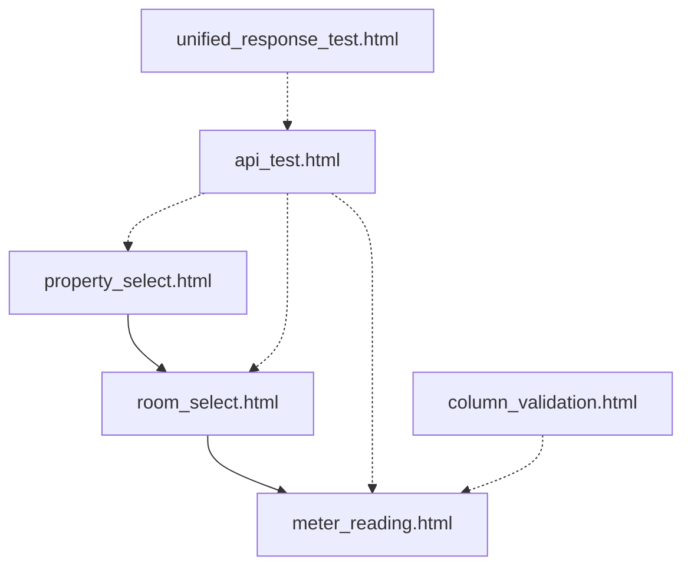

# HTML ファイル管理

このフォルダには、水道メーター読み取りアプリケーションで使用されるすべてのHTMLファイルが含まれています。

## 📁 フォルダ構成

### 🚀 main_app/ - メインアプリケーション
**本番環境で使用される主要な画面ファイル**

- **`meter_reading.html`** - 検針データ入力・表示画面
  - 水道メーターの読み取り値入力
  - 過去の検針履歴表示
  - 使用量自動計算
  - PWA対応

- **`property_select.html`** - 物件選択画面
  - 物件一覧表示
  - 検索・フィルタ機能
  - 物件詳細情報表示

- **`room_select.html`** - 部屋選択画面
  - 選択された物件の部屋一覧
  - 部屋詳細情報表示
  - 検針状況表示

### 🧪 testing/ - テスト・開発用
**開発・デバッグ・テスト用のファイル**

- **`api_test.html`** - API動作テスト画面
  - Google Apps Script API接続テスト
  - レスポンス確認
  - エラーハンドリングテスト

- **`unified_response_test.html`** - 統一レスポンステスト
  - API レスポンス形式の統一テスト
  - データフォーマット検証
  - 互換性確認

### 🛠️ utilities/ - ユーティリティ
**開発支援・管理用のツール**

- **`column_validation.html`** - カラム検証ツール
  - スプレッドシートのカラム名検証
  - データマッピング確認
  - 整合性チェック

## 🔗 ファイル間の関係



## 🌐 デプロイメント構成

### 本番環境
```
/
├── meter_reading.html      ← メイン検針画面
├── property_select.html    ← 物件選択画面
└── room_select.html        ← 部屋選択画面
```

### 開発環境
```
/
├── main_app/              ← 本番ファイル
├── testing/               ← テストファイル
└── utilities/             ← 開発ツール
```

## 📱 PWA機能

### 対応ファイル
- `meter_reading.html` - フル PWA対応
- `property_select.html` - PWA対応
- `room_select.html` - PWA対応

### 機能
- オフライン対応
- インストール可能
- Service Worker対応
- キャッシュ戦略実装

## 🔧 開発時の利用方法

### 1. メイン開発
```bash
# メインアプリケーションファイルの編集
cd html_files/main_app
# meter_reading.html, property_select.html, room_select.html
```

### 2. API テスト
```bash
# API動作確認
cd html_files/testing
# api_test.html でAPI接続テスト
```

### 3. データ検証
```bash
# データ整合性確認
cd html_files/utilities
# column_validation.html でカラム検証
```

## 📋 各ファイルの主要機能

### meter_reading.html
- React使用のSPA
- 動的CSS読み込み
- リアルタイム使用量計算
- エラーハンドリング
- セッション管理

### property_select.html
- 物件データ取得・表示
- 検索機能
- レスポンシブデザイン
- セッションストレージ活用

### room_select.html
- 部屋データフィルタリング
- 検針状況表示
- ナビゲーション機能
- キャッシュ機能

## 🛡️ セキュリティ考慮事項

- XSS対策実装
- CSRF保護
- 入力値検証
- セッション管理
- HTTPSリダイレクト

## 📈 パフォーマンス最適化

- CSS動的読み込み
- 画像最適化
- キャッシュ戦略
- 遅延読み込み
- ミニファイ対応

## 🔄 更新履歴

- **2025-06-16**: HTMLファイルをカテゴリ別に整理
- **2025-06-15**: 動的CSS読み込み機能追加
- **2025-06-14**: PWA機能強化
- **2025-06-13**: レスポンシブデザイン改善

---
📧 サポート: GitHub Issues または開発者に連絡  
🔗 プロジェクト: https://github.com/your-repo/LINE_app_project
